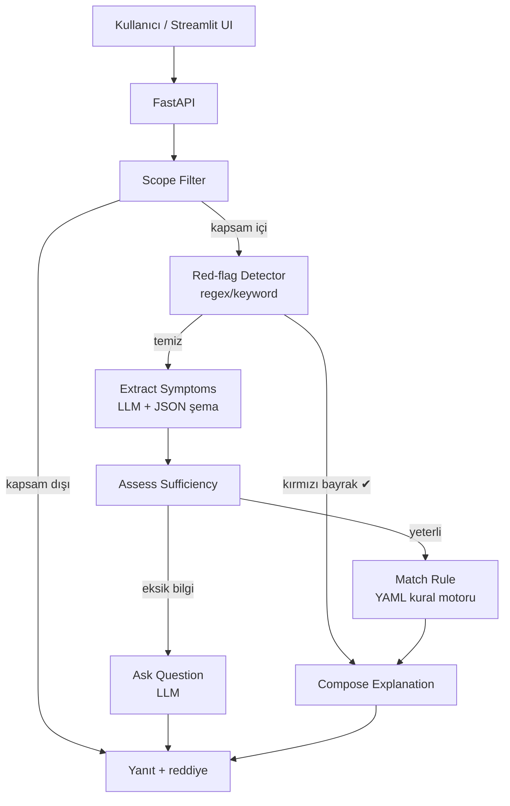

# 🚑 MedSim Triage

[](https://www.python.org/downloads/)
[](LICENSE)
[]()

**Eğitim ve simülasyon amaçlı, yerel LLM ile çalışan, kural-motoru-merkezli klinik triyaj agent prototipi.**

---

> ## ⚠️ ÖNEMLİ UYARI / DISCLAIMER
>
> **Bu sistem TIBBİ TANI KOYMAZ, TEDAVİ ÖNERMEZ ve İLAÇ DOZU VERMEZ.**
>
> Yalnızca **eğitim ve simülasyon** amaçlıdır. Hiçbir koşulda gerçek bir klinik
> karar destek sistemi, hekim muayenesi veya 112 acil çağrısının yerine geçmez.
> Acil bir durumdaysanız **lütfen ŞİMDİ 112'yi arayın** veya en yakın acil
> servise başvurun. Bu yazılımın gerçek hasta üzerinde kullanılması
> sorumluluğu kullanıcıya aittir; geliştiriciler her türlü sorumluluğu reddeder.

---

## Neden bu proje?

`medsim-triage`, Amaç:

- Modern bir **agent mimarisini** (LangGraph + structured outputs) somut bir
  problem üzerinde göstermek.
- **Yerel** (LM Studio) çalışan bir LLM ile, internete bağımlı olmadan,
  veri mahremiyetine saygılı bir prototip kurmak.
- LLM'i tek karar verici yapmamayı, onun yerine **deterministik bir kural
  motorunu** otorite olarak konumlandırmayı öğretmek.
- Kırmızı bayrak (red-flag) örüntüleri için **LLM'den bağımsız**, sıfır
  yanlış-negatif hedefli bir tespit katmanı tasarlamak.

## Mimari



LLM'in görevleri **dar tutulmuştur**: yalnızca (1) yapılandırılmış semptom
çıkarımı, (2) eksik bilgi sorusu üretimi, (3) verilen kararı sade Türkçeyle
açıklama. **Triyaj rengini her zaman kural motoru belirler.**

Daha fazla ayrıntı: [`docs/architecture.md`](docs/architecture.md).

## Kurulum

```bash
# 1. Repoyu klonlayın
git clone <repo-url>
cd medsim-triage

# 2. Sanal ortam oluşturun
python -m venv .venv
source .venv/bin/activate    # Windows: .venv\Scripts\activate

# 3. Geliştirme bağımlılıklarıyla kurun
pip install -e ".[dev]"

# 4. Ortam dosyasını hazırlayın
cp .env.example .env
```

## LM Studio kurulumu

1. [LM Studio'yu indirin](https://lmstudio.ai/) ve kurun.
2. Uygulamayı açın → sol panelden bir **chat model** indirin
   (örn. `Llama 3.1 8B Instruct`, `Qwen 2.5 7B Instruct` gibi structured-output
   destekli bir model).
3. Sol paneldeki **Developer** sekmesine geçin.
4. **Start Server** düğmesine basın (varsayılan port: `1234`).
5. `.env` dosyanızda `LM_STUDIO_MODEL` değerini yüklediğiniz modelin id'siyle
   güncelleyin.

## Hızlı başlangıç

```bash
# (a) LM Studio bağlantısını doğrulayın
python scripts/lm_studio_check.py

# (b) FastAPI'yi başlatın
bash scripts/run_api.sh
# → http://localhost:8000/health
# → http://localhost:8000/docs (Swagger)

# (c) Yeni bir terminalde Streamlit UI'ı başlatın
bash scripts/run_ui.sh
# → http://localhost:8501
```

## Geliştirme komutları

| Komut                       | Ne yapar                              |
| --------------------------- | ------------------------------------- |
| `pytest tests/ -v`          | Birim testleri (LM Studio gerektirmez) |
| `pytest -m integration`     | LM Studio gerektiren entegrasyon testleri |
| `ruff check src/`           | Lint                                  |
| `ruff format src/`          | Format kontrolü                        |
| `black src/`                | Formatla                              |
| `mypy src/`                 | Tip kontrolü                          |
| `python scripts/lm_studio_check.py` | LM Studio sağlık kontrolü       |

## Proje yapısı

```
medsim-triage/
├── src/medsim/
│   ├── schemas/         # Pydantic şemaları (triage, symptoms, conversation)
│   ├── llm/             # LM Studio istemcisi + prompt'lar
│   ├── rules/           # Kural motoru + kırmızı bayrak detektörü + YAML'lar
│   ├── rag/             # ChromaDB iskeleti (boş, sonraki fazda)
│   ├── agent/           # LangGraph state machine
│   ├── guardrails/      # Scope filter + output validator
│   ├── api/             # FastAPI uygulaması
│   └── ui/              # Streamlit prototipi
├── tests/               # pytest birim/entegrasyon testleri
├── scripts/             # run_api.sh, run_ui.sh, lm_studio_check.py
├── docs/                # disclaimer, architecture, schema dokümanları
└── eval/                # test_cases.yaml + metrics.py (iskelet)
```

## Sınırlamalar — bu sistem ne YAPMAZ

- ❌ Kesin tıbbi tanı koymaz.
- ❌ İlaç adı, dozaj veya tedavi protokolü önermez.
- ❌ Hukuki veya finansal tavsiye vermez.
- ❌ Gerçek hasta verisi üzerinde kullanılamaz.
- ❌ Hekim muayenesinin, 112'nin veya acil servis triyajının yerine geçmez.
- ❌ Şu anki halinde kural seti **placeholder** içerir; klinik geçerliliği yoktur.

## Yol haritası

- [x] **Faz 0 — İskelet:** kural motoru, kırmızı bayrak detektörü,
      LangGraph akışı, FastAPI, Streamlit UI, test çatısı.
- [ ] **Faz 1 — RAG dokümanları:** Sağlık Bakanlığı tebliğleri ve ESI/MTS
      referans materyalleri ChromaDB'ye indekslenecek.
- [ ] **Faz 2 — Kural seti zenginleştirme:** klinik uzman incelemesi
      altında 30-40 gerçek kuralla doldurma.
- [ ] **Faz 3 — Eval seti:** 100+ vakalı confusion-matrix tabanlı
      değerlendirme; sıfır yanlış-negatif hedefli kalibrasyon.
- [ ] **Faz 4 — Production hardening:** kalıcı conversation store,
      observability, rate limiting.

## Lisans

[MIT](LICENSE) — yalnızca eğitim/simülasyon kullanımı için. Gerçek tıbbi
kullanım için lisans veya destek vermez.

## Kaynaklar

- T.C. Sağlık Bakanlığı — Acil Servis Hizmetleri Tebliği (3 renkli triyaj)
- *Emergency Severity Index (ESI) Implementation Handbook*, AHRQ
- *Manchester Triage System (MTS)* — Mackway-Jones et al.
- LangGraph — https://langchain-ai.github.io/langgraph/
- LM Studio — https://lmstudio.ai/
