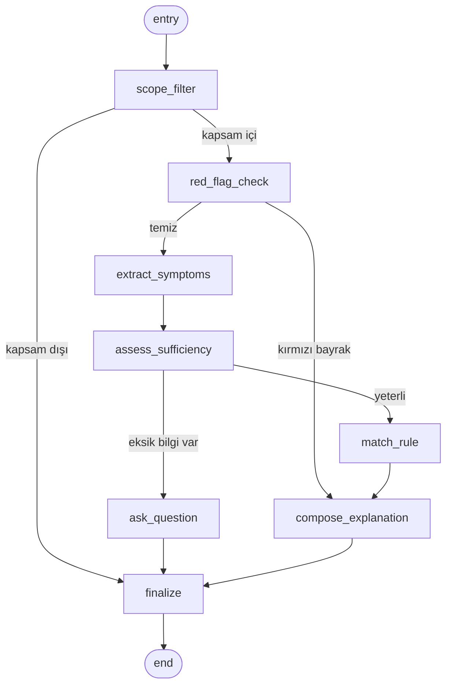
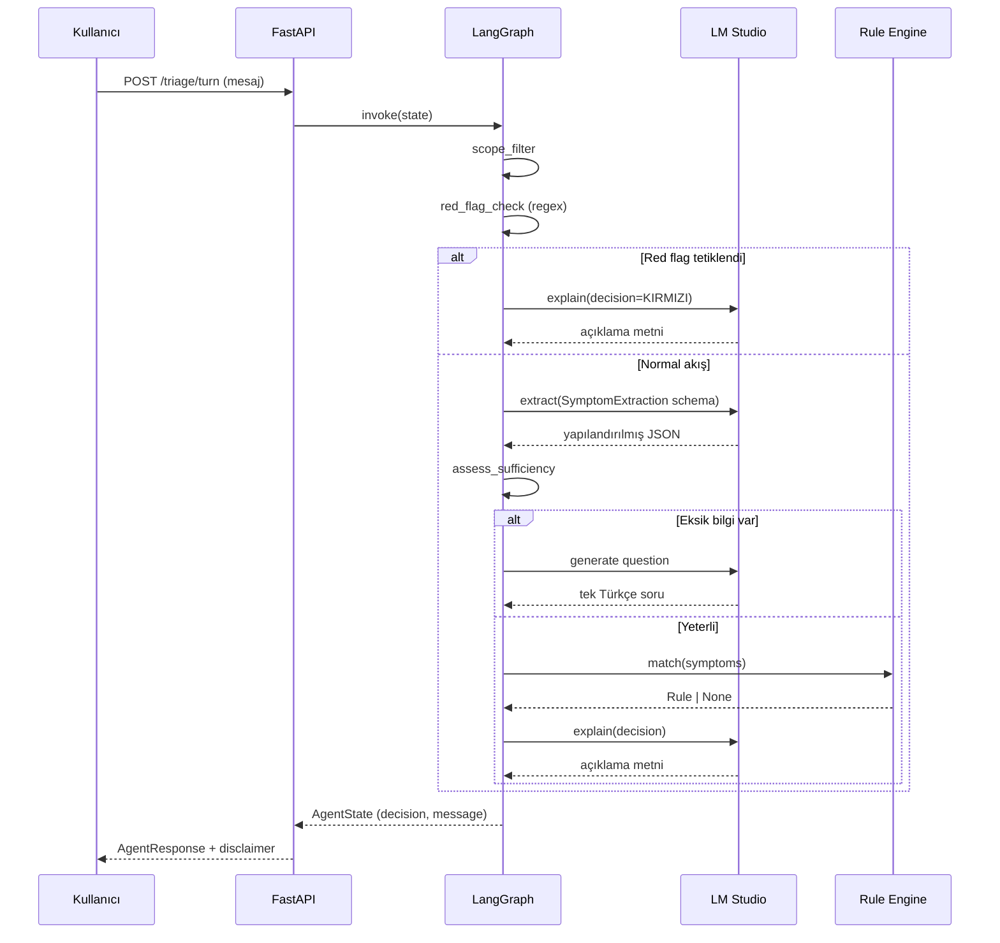

# Mimari

## Yüksek seviye katmanlar

```mermaid
flowchart LR
    subgraph Client
      UI[Streamlit UI<br/>:8501]
    end
    subgraph Server
      API[FastAPI<br/>:8000]
      AGENT[LangGraph Agent]
    end
    subgraph Services
      LLM[LM Studio<br/>:1234<br/>OpenAI-compat]
      RULES[YAML Rules<br/>+ Red Flags]
      RAG[ChromaDB<br/>(empty - phase 2)]
      GUARD[Guardrails<br/>scope + output]
    end
    UI -->|HTTP| API
    API --> AGENT
    AGENT --> LLM
    AGENT --> RULES
    AGENT --> RAG
    AGENT --> GUARD
```

- **UI** ve **API** birbirinden HTTP ile ayrılmıştır; UI değiştirilse de iş
  mantığına dokunulmaz.
- **Agent** yalnızca state geçişlerini orkestre eder; iş mantığı node
  fonksiyonlarına yayılmıştır.
- **LLM** *yalnızca* extraction, question generation ve explanation node'larından
  çağrılır. Karar verme node'u (match_rule) LLM'e dokunmaz.

## LangGraph node akışı



### Node sorumlulukları

| Node                     | Görev                                                  | LLM çağrısı |
| ------------------------ | ------------------------------------------------------ | ----------- |
| `scope_filter`           | Kapsam dışı talepleri (ilaç dozu, kesin tanı vb.) reddet | ❌ |
| `red_flag_check`         | Kritik semptom örüntülerini regex ile tara              | ❌ |
| `extract_symptoms`       | Yapılandırılmış semptom JSON'u çıkar                    | ✔ |
| `assess_sufficiency`     | Eksik alanları belirle                                  | ❌ |
| `ask_question`           | Bir sonraki en bilgilendirici soruyu üret               | ✔ |
| `match_rule`             | Kural motorunu çalıştır, **kararı belirle**             | ❌ |
| `compose_explanation`    | Karar + kuralı sade Türkçeyle açıkla                    | ✔ |
| `finalize`               | Yanıtı paketle                                          | ❌ |

## Veri akışı: kullanıcı mesajından karara



## Tasarım kararları

### Neden LLM karar veremiyor?

- **Tutarlılık:** aynı girdi her zaman aynı kararı vermeli — bu, olasılıksal
  modellerle garanti edilemez.
- **Denetlenebilirlik:** her karar bir `triggered_rule_id`'ye geri izlenebilir
  olmalı.
- **Klinik onay:** kuralları klinik uzman gözden geçirebilir; LLM ağırlıklarını
  gözden geçiremez.

### Neden kırmızı bayrak ayrı bir katman?

- **Sıfır yanlış-negatif** hedefi — LLM dökümün hatalı çıkartabilir, regex
  çıkartamaz.
- **Hız** — LLM çağrısından önce çalışır; kritik durumlarda gereksiz token
  harcamaz.
- **Çevrimdışı çalışabilir** — LM Studio kapalı olsa bile bu katman
  çalışmaya devam eder.

### Neden in-memory conversation store?

Faz 0 prototipidir. Production için Redis/Postgres planlanmıştır
(`api/dependencies.py` içinde TODO).
